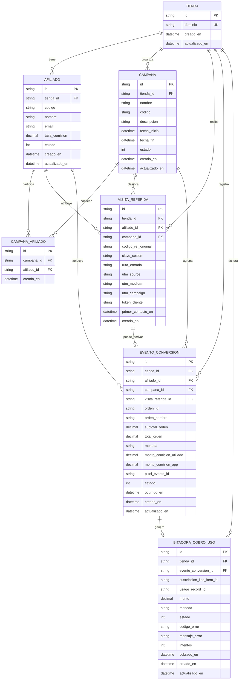

# Modelo de Datos (en espanol) y Diagrama ER

Este modelo usa:

- nombres de entidades/campos en espanol,
- estatus numericos en base de datos,
- enumerados separados para mapear codigo -> etiqueta.

## 1) Diagrama Entidad-Relacion (ER)

## 2) Enumerados separados (catalogos de estatus)

La base guarda solo enteros. Las etiquetas se resuelven en codigo (TypeScript enums/const).

### `estado_afiliado`

- `0` -> `INACTIVO`
- `1` -> `ACTIVO`
- `2` -> `SUSPENDIDO`

### `estado_conversion`

- `1` -> `PENDIENTE`
- `2` -> `PROCESADA`
- `3` -> `DESCARTADA`
- `4` -> `ERROR`

### `estado_cobro_uso`

- `1` -> `PENDIENTE`
- `2` -> `EXITOSO`
- `3` -> `FALLIDO`
- `4` -> `REINTENTANDO`

### `estado_campana`

- `0` -> `BORRADOR`
- `1` -> `ACTIVA`
- `2` -> `PAUSADA`
- `3` -> `FINALIZADA`

## 3) Entidades y finalidad

### `TIENDA`

- Tenant de Shopify (base multi-tenant).
- `dominio` unico global (`*.myshopify.com`).

### `AFILIADO`

- Configuracion de afiliados por tienda.
- `codigo` es el identificador funcional en `?ref=...`.
- `tasa_comision` definida por el merchant (0 a 1).
- `estado` numerico segun `estado_afiliado`.

### `CAMPANA`

- Agrupa estrategia comercial (ej. `BLACKFRIDAY-2026`).
- Permite medir resultados por temporada/canal.
- `estado` numerico segun `estado_campana`.

### `CAMPANA_AFILIADO`

- Relacion N:M entre campanas y afiliados.
- Permite habilitar afiliados por campana sin duplicar entidades.

### `VISITA_REFERIDA`

- Registro del primer contacto atribuido a afiliado.
- Soporta trazabilidad de origen (`utm_*`, ruta, sesion).
- `campana_id` opcional para clasificacion (por ejemplo, Black Friday).
- Puede existir sin conversion posterior.

### `EVENTO_CONVERSION`

- Compra atribuida desde Web Pixel (`checkout_completed`).
- Guarda montos calculados para auditoria:
  - comision afiliado,
  - comision app (regla 5%).
- `campana_id` opcional para analitica por campana.
- `estado` numerico segun `estado_conversion`.

### `BITACORA_COBRO_USO`

- Evidencia de llamada a Billing API por conversion.
- Registra resultado, error, reintentos y `usage_record_id`.
- `estado` numerico segun `estado_cobro_uso`.

## 4) Restricciones (modelo de datos)

### Integridad referencial (FK)

- `AFILIADO.tienda_id -> TIENDA.id`
- `VISITA_REFERIDA.tienda_id -> TIENDA.id`
- `VISITA_REFERIDA.afiliado_id -> AFILIADO.id`
- `VISITA_REFERIDA.campana_id -> CAMPANA.id` (nullable)
- `EVENTO_CONVERSION.tienda_id -> TIENDA.id`
- `EVENTO_CONVERSION.afiliado_id -> AFILIADO.id`
- `EVENTO_CONVERSION.campana_id -> CAMPANA.id` (nullable)
- `EVENTO_CONVERSION.visita_referida_id -> VISITA_REFERIDA.id` (nullable)
- `BITACORA_COBRO_USO.tienda_id -> TIENDA.id`
- `BITACORA_COBRO_USO.evento_conversion_id -> EVENTO_CONVERSION.id`
- `CAMPANA.tienda_id -> TIENDA.id`
- `CAMPANA_AFILIADO.campana_id -> CAMPANA.id`
- `CAMPANA_AFILIADO.afiliado_id -> AFILIADO.id`

### Unicidad (UNIQUE)

- `TIENDA.dominio`
- `AFILIADO (tienda_id, codigo)`
- `CAMPANA (tienda_id, codigo)`
- `CAMPANA_AFILIADO (campana_id, afiliado_id)`
- `EVENTO_CONVERSION (tienda_id, orden_id)` (idempotencia principal)
- `EVENTO_CONVERSION (tienda_id, pixel_evento_id)` cuando `pixel_evento_id` no sea null
- `BITACORA_COBRO_USO.usage_record_id` cuando exista
- `BITACORA_COBRO_USO.evento_conversion_id` si dejas un cobro final por conversion

### Reglas CHECK recomendadas

- `AFILIADO.tasa_comision >= 0 AND <= 1`
- `AFILIADO.estado IN (0,1,2)`
- `CAMPANA.estado IN (0,1,2,3)`
- `EVENTO_CONVERSION.total_orden >= 0`
- `EVENTO_CONVERSION.monto_comision_app >= 0`
- `EVENTO_CONVERSION.estado IN (1,2,3,4)`
- `BITACORA_COBRO_USO.monto >= 0`
- `BITACORA_COBRO_USO.intentos >= 0`
- `BITACORA_COBRO_USO.estado IN (1,2,3,4)`

## 5) Indices recomendados

- `AFILIADO(tienda_id, estado)`
- `CAMPANA(tienda_id, estado, fecha_inicio DESC)`
- `VISITA_REFERIDA(tienda_id, afiliado_id, creado_en DESC)`
- `VISITA_REFERIDA(tienda_id, campana_id, creado_en DESC)`
- `EVENTO_CONVERSION(tienda_id, ocurrido_en DESC)`
- `EVENTO_CONVERSION(tienda_id, afiliado_id, ocurrido_en DESC)`
- `EVENTO_CONVERSION(tienda_id, campana_id, ocurrido_en DESC)`
- `BITACORA_COBRO_USO(tienda_id, estado, creado_en DESC)`

## 6) Notas de implementacion (Prisma + SQLite)

- Usar `Decimal` para montos (evitar `Float`).
- Resolver etiquetas de estatus en capa de dominio (enum separado).
- Validar estados permitidos en servicio + DB (CHECK cuando aplique).
- Mantener `creado_en/actualizado_en` para auditoria.

## 7) Mapeo requisito -> entidad

- CRUD afiliados -> `AFILIADO`
- Gestion de campanas -> `CAMPANA` + `CAMPANA_AFILIADO`
- Captura `?ref=` -> `VISITA_REFERIDA`
- Evento `checkout_completed` -> `EVENTO_CONVERSION`
- Cobro 5% por usage -> `BITACORA_COBRO_USO` + `EVENTO_CONVERSION.monto_comision_app`
- Dashboard -> agregaciones sobre `EVENTO_CONVERSION` (y conciliacion con `BITACORA_COBRO_USO`)
